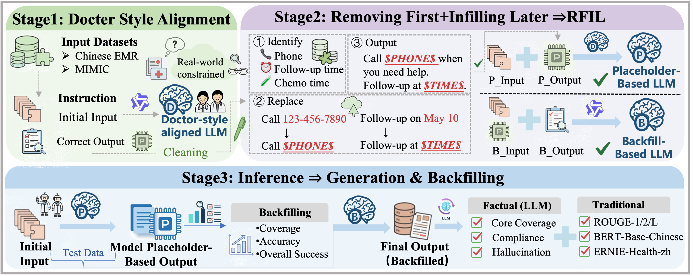

# Removing First, Infilling Later: Decoupling Environment-Dependent Facts to Mitigate Hallucinations in Clinical Discharge Summaries

## Introduction

Welcome to **RFIL**, an instruction-based framework for medical language model development and evaluation. RFIL leverages electronic medical record (EMR) data to construct structured instruction datasets and supports different clinical reasoning tasks through flexible and modular pipelines. By organizing heterogeneous clinical information into standardized instruction formats, RFIL enables effective instruction tuning and evaluation under realistic medical settings.

